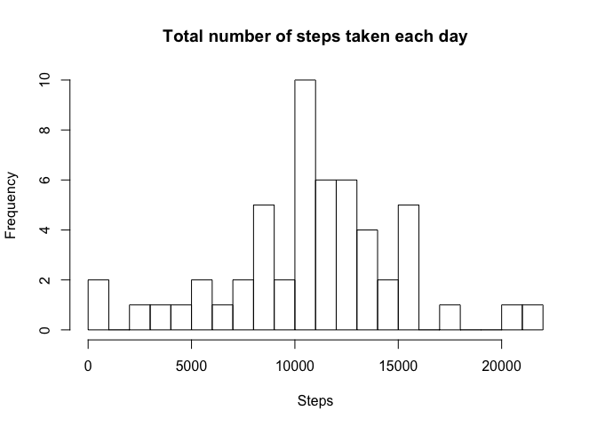
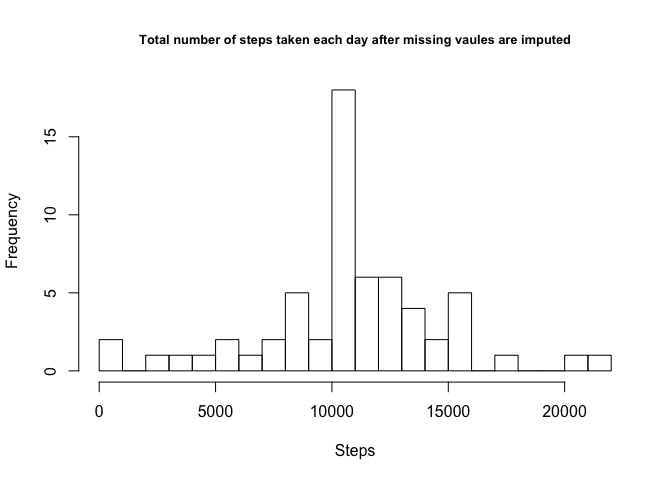
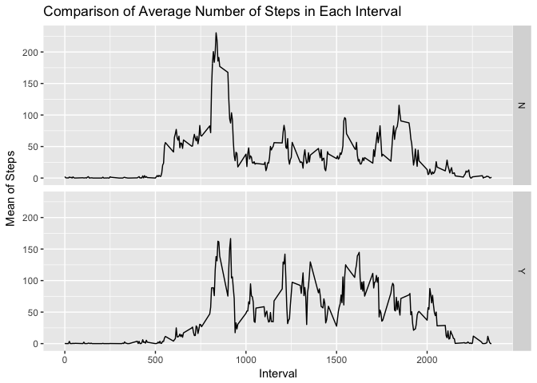

Week 2 - Project
================

### 1. Code for the reading in the dataset and/or processing the data

``` r
unzip("data.zip")
data <- read.csv("activity.csv")
str(data)
```

    ## 'data.frame':    17568 obs. of  3 variables:
    ##  $ steps   : int  NA NA NA NA NA NA NA NA NA NA ...
    ##  $ date    : Factor w/ 61 levels "2012-10-01","2012-10-02",..: 1 1 1 1 1 1 1 1 1 1 ...
    ##  $ interval: int  0 5 10 15 20 25 30 35 40 45 ...

The data has NA values in steps. Let's remove those missing values,

``` r
Data <- na.omit(data)
str(Data)
```

    ## 'data.frame':    15264 obs. of  3 variables:
    ##  $ steps   : int  0 0 0 0 0 0 0 0 0 0 ...
    ##  $ date    : Factor w/ 61 levels "2012-10-01","2012-10-02",..: 2 2 2 2 2 2 2 2 2 2 ...
    ##  $ interval: int  0 5 10 15 20 25 30 35 40 45 ...
    ##  - attr(*, "na.action")=Class 'omit'  Named int [1:2304] 1 2 3 4 5 6 7 8 9 10 ...
    ##   .. ..- attr(*, "names")= chr [1:2304] "1" "2" "3" "4" ...

### 2. Histogram of the total number of steps taken each day

``` r
library(ggplot2)
library(dplyr)
```

    ## 
    ## Attaching package: 'dplyr'

    ## The following objects are masked from 'package:stats':
    ## 
    ##     filter, lag

    ## The following objects are masked from 'package:base':
    ## 
    ##     intersect, setdiff, setequal, union

``` r
Data.day <- group_by(Data, date)
Data.day <- summarise(Data.day, steps = sum(steps))
hist(Data.day$steps, breaks = 30, xlab = "Steps", main = "Total number of steps taken each day")
```



### 3. Mean and median number of steps taken each day

``` r
mean(Data.day$steps)
```

    ## [1] 10766.19

``` r
median(Data.day$steps)
```

    ## [1] 10765

### 4. Time series plot of the average number of steps taken

``` r
Data.interval <- group_by(Data, interval)
Data.interval <- summarise(Data.interval, steps = mean(steps))
ggplot(Data.interval, aes(x=interval,y=steps)) + geom_line()
```


### 5. The 5-minute interval that, on average, contains the maximum number of steps

``` r
subset(Data.interval, steps == max(steps))
```

    ## # A tibble: 1 x 2
    ##   interval steps
    ##      <int> <dbl>
    ## 1      835  206.

### 6. Code to describe and show a strategy for imputing missing data

My strategy is to use the mean of 5-minute interval to replace the missing data.

``` r
sum(is.na(data))
```

    ## [1] 2304

``` r
impute.fun <- function(x) replace(x, is.na(x), mean(x, na.rm = TRUE))
data.complete <- (data %>% group_by(interval) %>% mutate(steps = impute.fun(steps)))
head(data.complete)
```

    ## # A tibble: 6 x 3
    ## # Groups:   interval [6]
    ##    steps date       interval
    ##    <dbl> <fct>         <int>
    ## 1 1.72   2012-10-01        0
    ## 2 0.340  2012-10-01        5
    ## 3 0.132  2012-10-01       10
    ## 4 0.151  2012-10-01       15
    ## 5 0.0755 2012-10-01       20
    ## 6 2.09   2012-10-01       25

``` r
sum(is.na(data.complete))
```

    ## [1] 0

### 7. Histogram of the total number of steps taken each day after missing values are imputed

``` r
data.complete.day <- group_by(data.complete, date)
data.complete.day <- summarise(data.complete.day, steps = sum(steps))
hist(data.complete.day$steps, breaks = 30, xlab = "Steps", main = "Total number of steps taken each day after missing vaules are imputed", cex.main=0.8)
```



### 8. Panel plot comparing the average number of steps taken per 5-minute interval across weekdays and weekends

``` r
library(lubridate)
```

    ## 
    ## Attaching package: 'lubridate'

    ## The following object is masked from 'package:base':
    ## 
    ##     date

``` r
data.complete$weekday <- weekdays(ymd(data.complete$date))
data.complete$weekend <- ifelse(data.complete$weekday == "Saturday" | data.complete$weekday == "Sunday", "Y", "N")
WW <- data.complete %>% group_by(interval, weekend) %>% summarize(mean = mean(steps))
ggplot(WW, aes(x = interval, y = mean)) + geom_line() +
    facet_grid(weekend ~.) + xlab("Interval") + ylab("Mean of Steps") +
    ggtitle("Comparison of Average Number of Steps in Each Interval")
```


